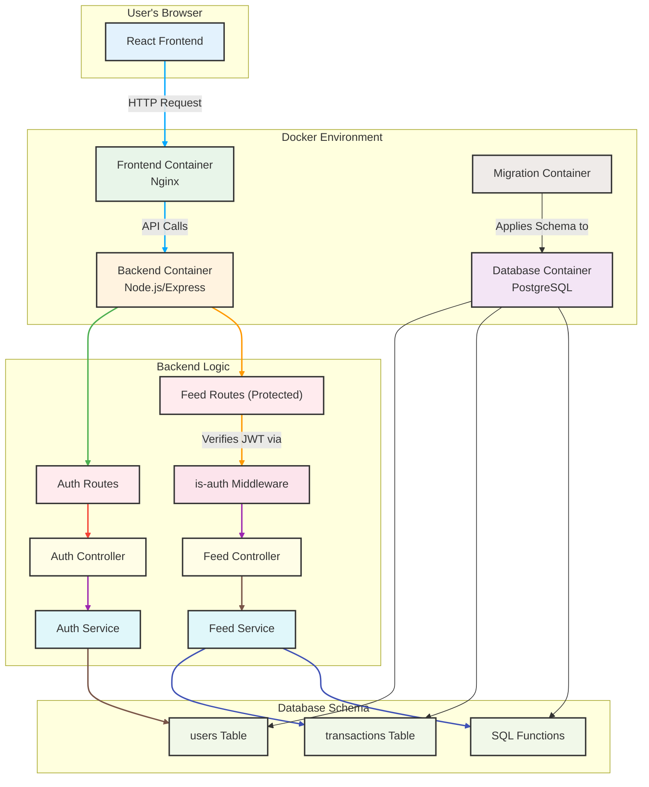

# Building a Personal Finance Management App: Integrating REST API, Node.js, Express.js, TypeScript, PostgreSQL, and Docker

This is the code for the blogs 

[Building a Personal Finance Management App: Database Setup with PostgreSQL and Docker.](https://medium.com/towards-data-engineering/building-a-personal-finance-management-app-database-setup-with-postgresql-and-docker-5075e283303e)

[Building a Personal Finance Management App: Integrating REST API, Node.js, Express.js, TypeScript and Docker](https://medium.com/towards-data-engineering/building-a-personal-finance-management-app-integrating-rest-api-node-js-7a0f0f27bd4e)


## Motivation
Through this project, I had the opportunity to strengthen my skills and gain a comprehensive understanding of several key areas:

1. Developing a basic REST API using ExpressJS/Typescript to handle backend operations.
2. Designing and implementing a data model in PostgreSQL tailored to my specific requirements.
3. Creating a user-friendly dashboard with ReactJS for the frontend.
4. Containerizing the application's components using Docker to simplify deployment and ensure consistency across environments.
5. Orchestrating all these components to work seamlessly together, providing a cohesive user experience.

I chose to create a finance app because I was in search of a robust solution for documenting and managing my finances. 
The goal was to move away from the current approach of using multiple, extensive Excel spreadsheets, and instead, consolidate everything into a single, efficient platform.

**NOTE**  
This is still an in progress project and intended for personl use.
Hence there is plenty room for development and adjustments if you want to use it and tailor it to your needs 

## App Structure

The application consists of the 3 components

- Backend: NodeJS, ExpressJS, Typescript
- Database: PostgreSQL, node-pg-migrate
- Frontend: ReactJS, Typescript

Backend and Frontend communicate via a basic `RestAPI`

All the components are containerized in `Docker` containers.

To run the project you first need to clone the repo
```
git clone {repo}
```

Then to start the containers you run

```
docker-compose up -d
```

you can also build your container by
````
docker-compose up --build
````

eventually you can access the frontend from

http://localhost/3001

if you want to shutdown the process then use
````
docker-compose down 
````
or
````
docker-compose down -v
````
to remove the data volumes

***Change the port in docker-compose for `frontend` if `3001` is blocked for any reason.***

### Demo
Below is how the dashboard looks like with some demo data


**Note** 

Currency is hardcoded as danish crowns (DKK) in the frontend


## Backend/Database
Backend communicates with Frontend via a REST API and stores the data in PostgeSQL.

The Data model consists of 3 tables that contain all the relevant information for the dashboard.

Transactions: The day to day expenses and income

Expense Categories: The main expenses areas (eg. Personal running costs)

Expense Types: More detailed expenses that belong to one of the main categories (eg. Restaurants)


## Frontend

The template, idea and resources for this dashboard were inspired by the following repo and corresponding youtube tutorial

Github: https://github.com/ed-roh/finance-app

Youtube: https://www.youtube.com/watch?v=uoJ0Tv-BFcQ


# System (WIP)



### Breakdown of the Diagram:
- User's Browser: This is where the React frontend lives and runs. It makes HTTP requests to the server.
- Docker Environment:
This is the core of our infrastructure, managed by docker-compose.
- Frontend Container: Serves static React files using a lightweight Nginx web server.
- Backend Container: Runs Node.js/Express application, which contains all the API logic.
- Database Container: Runs the PostgreSQL database where the data is stored.
- Migration Container: A short-lived container that runs to set up or update the database schema and then exits.

### Backend Logic (Inside the Node.js Container):
- Routes (/auth, /feed): The entry points for all incoming API requests.
- is-auth Middleware: The "bouncer" that protects the /feed routes by checking the JWT.
- Controllers: Handle the request/response cycle, calling services to do the actual work.
- Services: Contain the core business logic and database queries, keeping the code organized.
- Database Schema (Inside the PostgreSQL Container):
- Tables: The users and transactions tables that store your core data.
- SQL Functions: Custom functions to perform complex calculations directly in the database for better performance.
